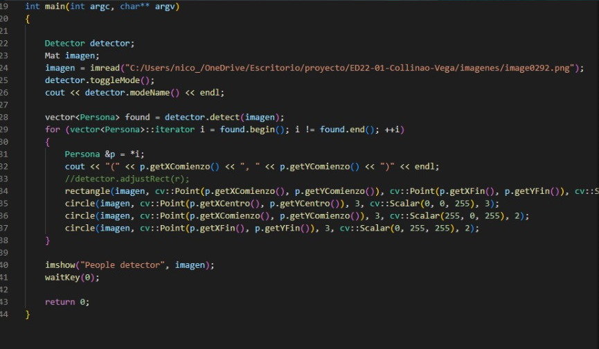
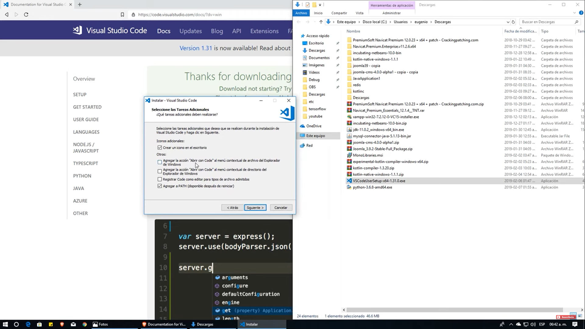

# Informe Técnico 
## Curso: Estructura de datos
### Detección e identificación de personas en secuencias de imágenes o video

**Alumnos:**

* Claudia Collinao Rojas (Coordinadora)
* Nicolás Vega Vega (Programador)

## Resumen 

> Este trabajo tiene como finalidad desarrollar e implementar un sistema de conteo e identificación de personas; para lograr nuestro objetivo tuvimos que desarrollar un programa en lenguaje C++, usando la librería OpenCV. En primera instancia, utilizamos listas enlazadas para detectar y marcar la zona ocupada por la persona que entra o sale del recinto, creando una clase llamada "Detector" la cual implementa la detección de la persona y dibuja un rectángulo alrededor de ella para su posterior identificación; luego definimos la acción de entrar y salir al lugar e implementamos un contador para poder contar las personas que entran y salen en un determinado tiempo del lugar y la cantidad de veces que lo hacen.  

## 1. Introducción
Actualmente es muy común la búsqueda de tecnología en sistemas para controlar la cantidad de personas que visitan los espacios cerrados, ya sea con un sistema de vigilancia, análisis de flujos de movimientos de personas, control de acceso o de aforo, etc.Además, este tipo de aplicaciones han tomado mucha importancia en los útimos años, dadas las necesidades de prevenir situaciones como robos, detección de situaciones peligrosas, identificación de personas buscadas por la ley.
Para tratar de resolver este problema se han planteado propuestas mediante la utilización de distintos sensores de visión con elementos como laser, luz infraroja, etc. Los cuales son eficaces al momento de contar la cantidad de personas que pasan por este sensor, pero no así la identificación de personas, ya sea para saber sus movimientos dentro del recinto(entrar y/o salir) o saber la cantidad de veces que ha entrado o ha salido,  

### 1.1 Descripción del problema

Se nos pide como estudiantes del curso de Estructura de datos, construir un sistema de vigilancia que cuente las personas que transitan en una zona determinada de un edificio. Este sistema de vigilancia contará con un dispositivo tecnológico que puede ser una cámara de video o simplemente el video capturado. Siendo el objetivo de este proyecto lograr captar e identificar las personas que entran y salen del lugar en estudio, para así contabilizar la cantidad de personas que entran y salen, saber cuántas diferentes personas pasan por la zona de conteo, calcular la velocidad con la cual ingresa cierta cantidad de personas en un tiempo determinado (Personas/tiempo), y como último requerimiento listar a las personas que más han entrado o salido del lugar.

### 1.2 Objetivos 

**Objetivo General**

Desarrollar un sistema de conteo e identificación de personas mediante algoritmos analíticos de imagenes de video.

**Objetivos específicos**

1. Implementar la detección de personas que pasan por la imagen de video.
2. Establecer zona de salida y zona de entrada al control.
3. Contar e identificar las personas que entran y salen del control.
4. Calcular la velocidad de entrada y salida de personas.

### 1.3 Solución propuesta

La solución propuesta en la detección de personas, al momento que la persona(s) aparezcan en la imagen o video porque aun no se ve bien como se llevara a cabo la ejecución del problema mediante códigos en lenguaje c++, tendrá que reconocer a cada persona y a su vez ver si esa persona ya pasó por la zona de control, con el calculo del centroide que se llevara a cabo.

Si se toma un punto de la imagen como positivos y vemos que al moverse y calcular la diferencia del centroide de una misma persona que se guardara en un nodo persona es positiva entonces eso quiere decir que esta entrando la persona. En caso contrario si se calcula y da negativo significará de estará saliendo todo esto ya registrado en un nuevo nodo de personas de salidas personas entrada.
Luego de tener eso registrados en dichos nodos se puede ya calcular con el mismo nodo correspondiente de salida o entrada cuentas personas corresponde para desplegar el calcula de persona que pasan entran/salen en una determinada hora y su diferencia.

## 2. Materiales y métodos

Primero se utilizará la IDE Visual Studio Code y Librerías para procesamiento de imágenes en C++, OpenCV y CMake luego de eso instalado correctamente se pasara a la clonación del repositorio en github para finalmente empezar a codificar la solución del problemas 
Hay que mencionar que antes de la clonación del repositorio hay que descargar git y github desktop

### 2.1 Instalación

**Librerías:**

 

**-OpenCV:** (Open Source Computer Vision) es una librería multiplataforma originalmente desarrollada como proyecto por Intel para apoyar a los primeros compiladores Intel C++ y Microsoft Visual C++ en x86. Es muy utilizada actualmente para el procesamiento de imágenes y la visión artificial en general, también se ha utilizado en infinidad de aplicaciones como control de procesos, sistemas de seguridad con detección de movimiento, reconocimiento de objetos, robótica avanzada, etc.

**Programas:**

 

**-Visual Studio Code :** Este programa es un editor de texto plano desarrollado por Microsoft como software OpenSource y es totalmente gratuito para todo tipo de usuarios para que cualquiera pueda programar en prácticamente cualquier lenguaje.

**Extenciones:**

 

**- C/C++ :** Este paquete de extensión incluye un conjunto de extensiones populares para el desarrollo del lenguajes C/C++ en Visual Studio Code.

**- C/C++ run :** Una extensión que se ejecuta en Visual Studio Code para compilar y ejecutar archivos individuales en lenguajes C/C++ fácilmente

**- CMake :** es una familia de herramientas multiplataforma de código abierto diseñada para crear, probar y empaquetar software. CMake se usa para controlar el proceso de compilación de software mediante una plataforma simple y archivos de configuración independientes del compilador, y genera archivos MAKE nativos y espacios de trabajo que se pueden usar en el entorno de compilación de su elección

### 2.2 Diseño 
 

Explicar los componentes (módulos o clases) utilizados para resolver el problema. Indicar arquitectura propuesta, diagrama de clases u otro artefacto que estime conveniente para explicar el diseño de su implimentación.

### 2.3 Implementación

Explicar brevemente algunos aspectos de implementación: Por ejemplo, detector de caras utilizado. Se pueden realizar pequeñas reseñas al código para indicar elementos importantes en el trabajo.

Por ejemplo, 

#### Detector de Personas
 

## 3. Resultados obtenidos

## 4. Conclusiones

Debido al aprendizaje obtenido en las clases, se nos dificulta mucho la implementación de codigos, además de las correcta instalación de las bibliotecas en el repositorio.
Logramos  detectar las personas con el centroide y con sus colores diferentes pero nos faltó la implementación de hacer una línea en la imagen o video para que los cálculos arrogados sean de mejor calidad para así llegar a la solución final y mucho mejor pensada que la solución mencionada en el inicio de este informe

# Anexos

## Anexo A: Instalación librerías OpenCV

## Anexo B: Instalación de IDE y configuración librerías OpenCV

 
 

# Referecia

1.CMake. (s. f.). https://cmake.org/
2.Librerías o Bibliotecas. (2020, 29 noviembre). programarya. Recuperado 24 de junio de 2022, de https://www.programarya.com/Cursos/C++/Bibliotecas-o-Librerias
3.Build software better, together. (s. f.). GitHub. Recuperado 24 de junio de 2022, de https://github.com/topics/people-counter?l=python
4.Hajeri, V. (2016, 27 julio). People counting System using OpenCV 3.1 [Vídeo]. YouTube. https://www.youtube.com/watch?v=SewTS0bj1gU&feature=youtu.be

